<div align="center">


<h1>GDPR DPIA Toolkit</h1>

<p><strong>The Global Standard for Industrialized Data Protection Impact Assessments, Privacy Risk Management, and Compliance Automation</strong></p>

[]()
[]()
[]()
[]()

<br/>

> **"Industrializing privacy governance to automate DPIAs, mitigate data risks, and embed privacy-by-design across the modern digital enterprise."** 
> The GDPR DPIA Toolkit is a flagship repository designed to enable organizations to design, automate, govern, and monitor Data Protection Impact Assessments through structured workflows, risk engines, and executive analytics.

</div>

---

## 🏛️ Executive Summary

**GDPR DPIA Toolkit** is a flagship platform designed for Chief Privacy Officers (CPOs), Legal Counsel, and Data Governance leaders. Under GDPR, a Data Protection Impact Assessment (DPIA) is mandatory for processing that is likely to result in a high risk to the rights and freedoms of individuals. This platform transitions organizations from "Manual Spreadsheet-Based Assessments" to "Industrialized Privacy Orchestration," where privacy risks are identified and mitigated at the point of architectural design.

This platform provides an industrialized approach to **Privacy Governance Automation**, delivering production-ready **Assessment Engines**, **Risk Scorecards**, **Evidence Management**, and **Executive Dashboards**. It enables organizations to enforce global privacy standards across Cloud workloads, SaaS ecosystems, and AI platforms, ensuring continuous compliance and institutional trust.

---

## 💡 Why DPIA Platforms Matter

A DPIA platform is the "privacy guardrail" of the modern data-driven organization:
- **Mandatory Compliance**: Meeting the strict requirements of GDPR Article 35 for high-risk processing activities.
- **Privacy by Design**: Integrating privacy considerations into the earliest stages of product and system development.
- **Institutional Accountability**: Demonstrating to regulators (DPAs) that privacy risks have been systematically identified and mitigated.
- **Trust & Reputation**: Protecting the most valuable asset of the enterprise—customer trust—through proactive data protection.

---

## 🚀 Business Outcomes

### 🎯 Strategic Privacy Impact
- **100% DPIA Coverage**: Ensuring every high-risk processing activity is identified and assessed through automated screening.
- **Accelerated Time-to-Market**: Reducing privacy review bottlenecks through self-service intakes and automated workflow approvals.
- **Guaranteed Risk Mitigation**: Linking high-risk findings directly to technical and organizational controls for verified remediation.
- **Improved Data Governance**: Gaining a unified view of the enterprise data processing landscape and cross-border transfer risks.

---

## 🏗️ Technical Stack

| Layer | Technology | Rationale |
|---|---|---|
| **Backend** | Python (FastAPI) | High-performance gateway for assessment intake, risk scoring, and workflow orchestration. |
| **Privacy Engine** | Python / OPA | Robust logic for evaluating privacy risks against regulatory standards and internal policies. |
| **Frontend** | React 18, Vite | Premium portal for executive dashboards, assessment workspaces, and risk heatmaps. |
| **Persistence** | PostgreSQL | Relational metadata store for assessment history, evidence, and records of processing. |
| **Orchestration** | Redis / Workers | Managing background document generation, reminder notifications, and data catalog syncs. |

---

## 📐 Architecture Storytelling: 95+ Diagrams

### 1. Executive High-Level Architecture
The holistic vision of the enterprise GDPR privacy governance journey.

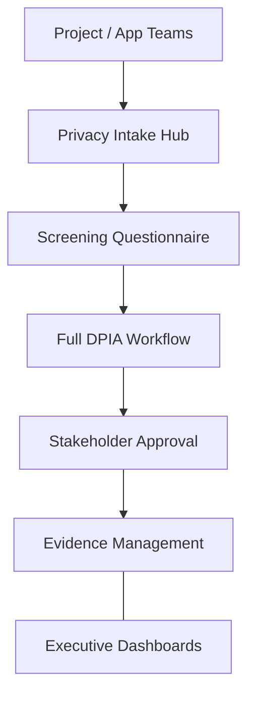

### 2. Detailed Platform Topology
The internal service boundaries and management layers of the industrialized DPIA platform.

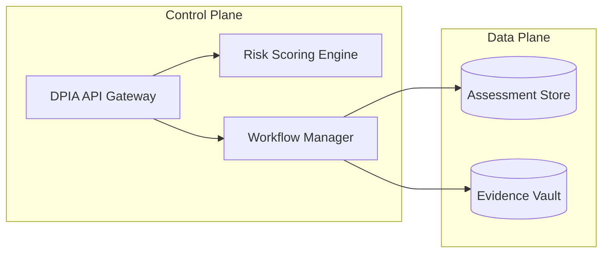

### 3. Intake Request to Approval Path
Tracing the path from a new project idea to a verified and approved DPIA.

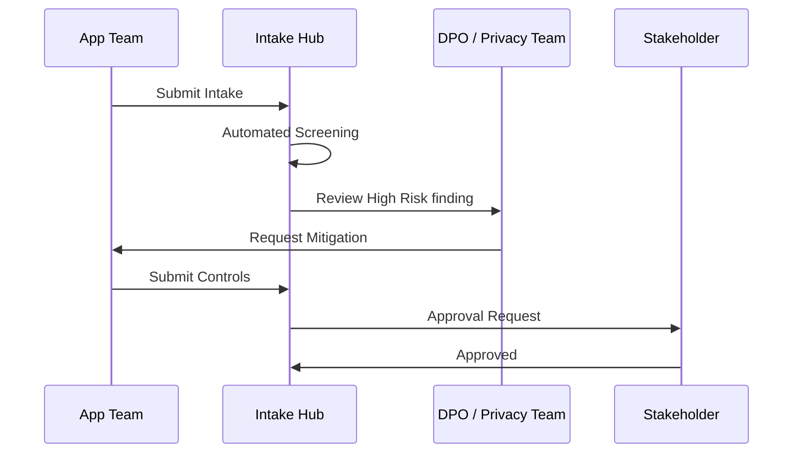

### 4. Privacy Control Plane
The "Brain" of the framework managing global institutional privacy standards and automated assessment workflows.

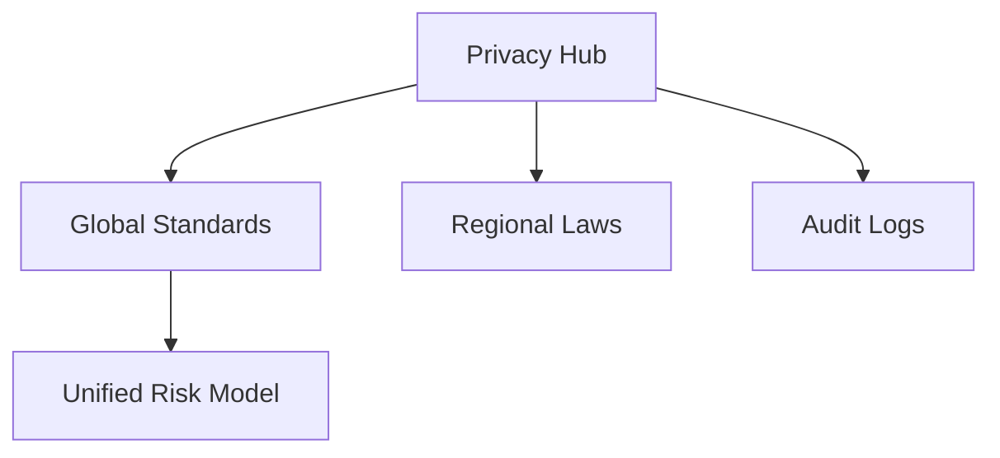

### 5. Multi-Cloud Topology
Synchronizing privacy reviews across Azure, AWS, and GCP for a unified institutional view.

```mermaid
graph LR
    Azure[AZ Workloads] <-> Bridge[DPIA Hub] <-> AWS[AWS Accounts]
    Bridge <-> GCP[GCP Projects]
```

### 6. Regional Deployment Model
Hosting assessment nodes close to global legal hubs for localized compliance and data residency.

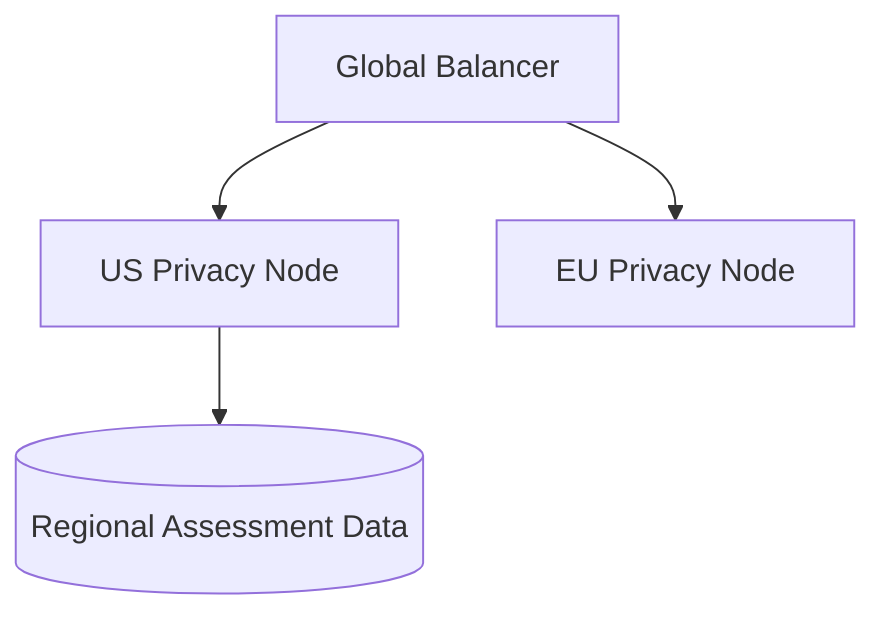

### 7. DR Failover Model
Ensuring platform continuity for critical privacy impact assessments and incident response.

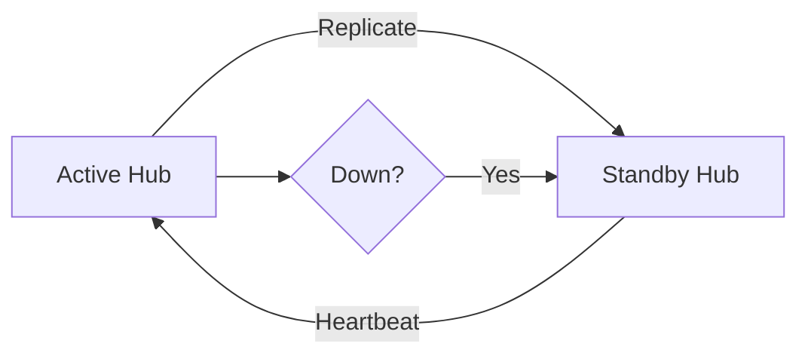

### 8. API Gateway Architecture
Securing and throttling the entry point for assessment requests and risk queries.

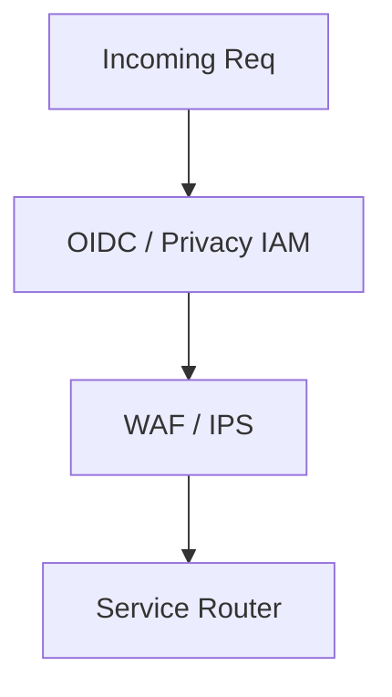

### 9. Queue Worker Architecture
Managing long-running document generations, mass notifications, and risk re-scorings.

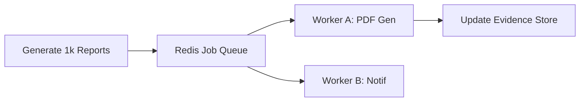

### 10. Dashboard Analytics Flow
How raw assessment telemetry becomes executive institutional privacy risk heatmaps.

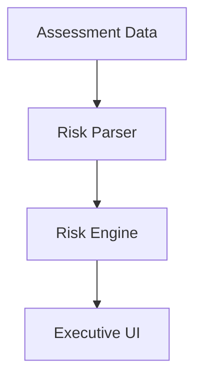

### 11. DPIA Intake Workflow
The standardized entry point for all new data processing activities.

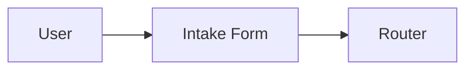

### 12. Screening Questionnaire Model
Automating the decision of whether a full DPIA is required based on processing criteria.

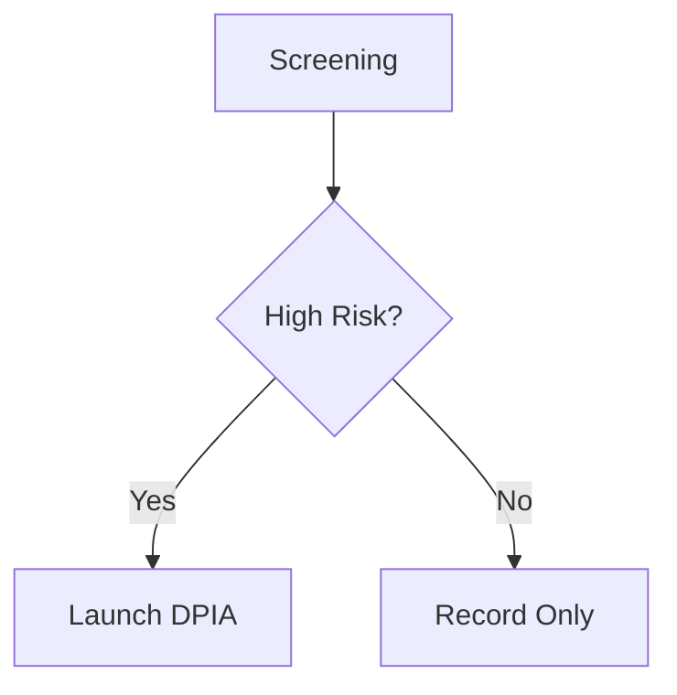

### 13. High-Risk Trigger Decision Tree
Mapping specific processing types (e.g., Biometrics, Profiling) to mandatory DPIA triggers.

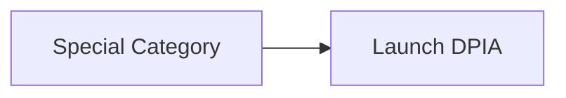

### 14. Stakeholder Approval Flow
Orchestrating reviews across Legal, DPO, Infosec, and Business Owners.

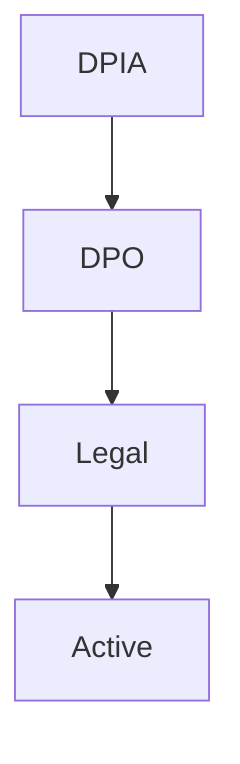

### 15. Privacy Steering Committee
The governing body for enterprise-wide privacy risk strategy and escalation.

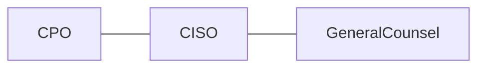

### 16. Risk Acceptance Process
The formal workflow for business owners to accept residual privacy risks.

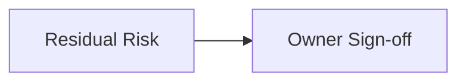

### 17. Exception Approval Lifecycle
Governing short-term deviations from privacy standards with compensating controls.

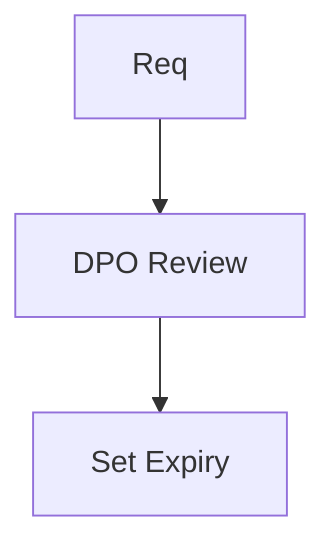

### 18. Control Evidence Model
Linking technical security controls to specific privacy risk mitigations.

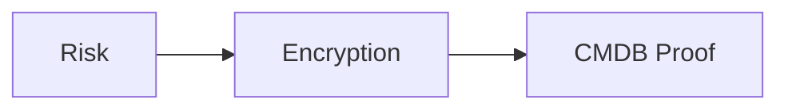

### 19. Quarterly Review Cadence
The automated rhythm for re-evaluating active DPIAs and data processing.

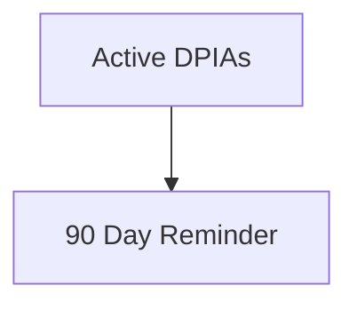

### 20. Continuous Update Workflow
Ensuring DPIAs evolve as application architectures and data flows change.

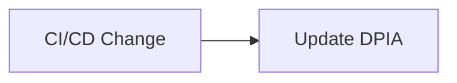

### 21. Lawfulness Fairness Transparency Model
Mapping every processing activity to one of the six GDPR legal bases.

```mermaid
graph TD
    Activity[Activity] --> Basis[Consent / Legitimate Interest]
```

### 22. Purpose Limitation Workflow
Governing the boundaries of why data is collected and ensuring no "function creep."

```mermaid
graph LR
    Origin[Original Purpose] --> Check[New Use Case?]
```

### 23. Data Minimization Lifecycle
Automating the review of whether collected data is "Adequate, Relevant, and Limited."

```mermaid
graph TD
    Fields[All Fields] --> Minimal[Required Only]
```

### 24. Accuracy Governance Model
Defining the controls for ensuring personal data is accurate and kept up to date.

```mermaid
graph LR
    Inbound[Data] --> Verify[Validation Service]
```

### 25. Storage Limitation Workflow
Enforcing institutional data retention schedules via automated deletion.

```mermaid
graph TD
    Collect[Collect] --> Age[7 Years] --> Delete[Auto Purge]
```

### 26. Integrity Confidentiality Model
Ensuring technical security (CIA) is embedded into the privacy assessment.

```mermaid
graph LR
    Data[Data] --> Encryption[AES-256] --> Secure[Privacy Box]
```

### 27. Accountability Evidence Chain
Building the "Audit Trail" of privacy compliance for regulatory reporting.

```mermaid
graph TD
    Action[Decision] --> Log[Immutable Log] --> Evidence[Audit Pack]
```

### 28. Privacy by Design Flow
Integrating privacy screening into the standard SDLC / Agile story cycle.

```mermaid
graph LR
    Jira[Jira Ticket] --> Hook[Privacy Screening]
```

### 29. Default Settings Governance
Auditing applications to ensure "Privacy by Default" configurations are active.

```mermaid
graph TD
    App[App] --> Config[Audit Opt-In]
```

### 30. Rights Enablement Workflow
Orchestrating the response to Data Subject Access Requests (DSAR).

```mermaid
graph LR
    Request[DSAR] --> Search[Auto Search] --> Report[Subject Pack]
```

### 31. Personal Data Lifecycle
Tracing data from Acquisition to Processing, Sharing, and finally Disposal.

```mermaid
graph TD
    Acq[Acquire] --> Proc[Process] --> Share[Third Party] --> Delete[End]
```

### 32. Cross-Border Transfer Review
Automating the Transfer Impact Assessment (TIA) for data leaving the EEA.

```mermaid
graph LR
    Origin[EU] --> Dest[USA] --> SCC[Standard Contractual Clauses]
```

### 33. Processor-Subprocessor Map
Visualizing the downstream chain of data processors for every DPIA.

```mermaid
graph TD
    Corp[Controller] --> Cloud[Processor] --> Tool[Sub-Processor]
```

### 34. Vendor Onboarding Privacy Flow
Integrating privacy risk assessments into the procurement and vendor lifecycle.

```mermaid
graph LR
    Buy[Procurement] --> Assessment[Privacy Review]
```

### 35. Records of Processing Linkage
Mapping every DPIA to the central Article 30 ROPA register.

```mermaid
graph TD
    DPIA[DPIA 123] <-> ROPA[ROPA 456]
```

### 36. Consent Capture Lifecycle
Tracking the lineage of user consent from opt-in to withdrawal.

```mermaid
graph LR
    Accept[Yes] --> Store[Audit ID] --> Withdraw[No]
```

### 37. Cookie Data Flow Model
Governing the categorization and disclosure of website tracking technologies.

```mermaid
graph TD
    Site[Site] --> Scan[Cookie Scan] --> CMP[Consent Banner]
```

### 38. Customer Analytics Flow
Orchestrating the privacy reviews for internal data science and BI projects.

```mermaid
graph LR
    Raw[Data] --> Clean[De-Identify] --> Insight[BI]
```

### 39. Marketing Suppression Model
Ensuring marketing platforms respect global "Unsubscribe" and privacy choices.

```mermaid
graph TD
    List[Audience] --> Scrub[Suppression List] --> Campaign[Send]
```

### 40. Deletion Request Workflow
The institutional process for fulfilling the "Right to be Forgotten."

```mermaid
graph LR
    Delete[Request] --> ERP[SAP] --> CRM[Salesforce] --> Ack[Complete]
```

### 41. AI DPIA Workflow
Advanced assessment for high-risk automated decision making and ML.

```mermaid
graph TD
    MLModel[Model] --> Screen[Explainability Check] --> DPIA[Review Bias]
```

### 42. Profiling Risk Assessment
Evaluating the privacy impact of tracking and predicting individual behavior.

```mermaid
graph LR
    Behavior[Clicks] --> Profile[Predictive Model] --> Score[Impact]
```

### 43. Automated Decision Review
Governing logic that produces legal or significant effects on individuals.

```mermaid
graph TD
    Input[Data] --> Algo[Decision] --> Human[Human in Loop]
```

### 44. Training Data Governance
Ensuring the "Legal Basis" for data used in training enterprise AI models.

```mermaid
graph LR
    Data[Pool] --> Source[Verified?] --> Train[Go]
```

### 45. Model Output Privacy Review
Auditing AI outputs to prevent the leakage of PII or training data.

```mermaid
graph TD
    Output[Result] --> Filter[PII Filter] --> User[View]
```

### 46. Data Anonymization Pipeline
The automated flow for converting PII into anonymous statistical aggregates.

```mermaid
graph LR
    In[PII] --> Mask[Masking] --> Out[Anon]
```

### 47. Pseudonymization Workflow
Separating data from identifiers to reduce risk while maintaining utility.

```mermaid
graph TD
    In[Data] --> Vault[Tokenize ID] --> Use[Research Data]
```

### 48. Synthetic Data Model
Generating fake data with the same statistical properties as real PII.

```mermaid
graph LR
    Pattern[Real] --> Generator[Model] --> Synthetic[Safe Data]
```

### 49. Children Data Safeguard Model
Specific assessment and control flow for data processing involving minors.

```mermaid
graph TD
    User[User] --> AgeGate[13+] --> Control[Higher Shield]
```

### 50. Biometric Data Control Flow
Orchestrating the strict controls required for sensitive biometric processing.

```mermaid
graph LR
    Face[Template] --> Encrypt[Hard Key] --> Segment[Locked VNET]
```

### 51. OIDC / SSO Auth Flow
Securing the DPIA platform with institutional identity and MFA.

```mermaid
graph TD
    User[DPO] --> EntraID[Entra ID] --> FST[GDPR Hub]
```

### 52. RBAC Model
Defining who can create, edit, approve, and view sensitive privacy assessments.

```mermaid
graph LR
    Role[Auditor] --> View[Read Only]
```

### 53. Encryption Key Lifecycle
Governing the keys used to protect the enterprise DPIA metadata and evidence.

```mermaid
graph TD
    Rotate[Rotate] --- Vault[Key Vault] --- Access[API]
```

### 54. Secrets Management Workflow
How the platform securely connects to multi-cloud APIs and data catalogs.

```mermaid
graph LR
    App[App] --> Secret[Stored Secret] --> Cloud[AWS]
```

### 55. Audit Logging Architecture
Capturing every action on the platform for non-repudiation and evidence.

```mermaid
graph TD
    Event[Change] --> Log[Audit Hub] --> SIEM[Sentinel]
```

### 56. Metrics Pipeline
The automated flow for capturing, processing, and storing privacy KPIs.

```mermaid
graph LR
    Ingest[Ingest] --> Process[Process] --> Store[Store]
```

### 57. Logging Architecture
The multi-layered approach to capturing platform activity and audit.

```mermaid
graph TD
    Auth[Auth] --- API[API] --- Engine[Risk]
```

### 58. Tracing Model
Observing the path of long-running document generations and risk syncs.

```mermaid
graph LR
    Req[Req] --> Queue[Redis] --> Worker[Engine]
```

### 59. Incident Response Workflow
The automated sequence for handling detected privacy breaches.

```mermaid
graph TD
    Alert[Breach] --> Triage[72h Clock] --> Notify[Regulator]
```

### 60. Breach Notification Coordination
Orchestrating communication between DPO, Legal, and affected data subjects.

```mermaid
graph LR
    Incident[Issue] --> Counsel[Legal] --> Users[Notice]
```

### 61. Executive KPI Review Cycle
Providing the Board with a unified view of institutional privacy posture.

```mermaid
graph LR
    KPI[DPIA %] --> Exec[Exec Report]
```

### 62. DPIA Completion Scorecard
Reporting the throughput and quality of privacy reviews per business unit.

```mermaid
graph TD
    Retail[10/10] --- HR[2/10]
```

### 63. Risk Heatmap Model
Identifying which projects or systems pose the highest privacy risk.

```mermaid
graph TD
    Payments[High] --- InternalDocs[Low]
```

### 64. Team Benchmark Comparison
Gamifying privacy compliance by comparing efficiency scores of different teams.

```mermaid
graph LR
    TeamA[Leader] <-> TeamB[Lagging]
```

### 65. Vendor Risk Dashboard
Aggregating privacy scores for all 3rd party data processors.

```mermaid
graph TD
    AWS[Low] --- NicheSaaS[Medium]
```

### 66. Monthly Reporting Workflow
The automated flow for creating PDF and portal reports for every department.

```mermaid
graph TD
    Data[Data] --> Template[Monthly View] --> PDF[Statement]
```

### 67. Board Reporting Model
The executive communication path for significant privacy risks and investments.

```mermaid
graph LR
    DPO[DPO] --> Board[Audit Comm]
```

### 68. PMO Operating Cadence
The institutional structure for the central Privacy PMO.

```mermaid
graph LR
    PMO[PMO] --- Teams[Teams]
```

### 69. Privacy Maturity Roadmap
The journey from "Compliance Checkbox" to "Strategic Privacy Advantage."

```mermaid
graph LR
    Crawl[DPIA] --> Run[Privacy-by-Design]
```

### 70. Continuous Improvement Loop
Evolving privacy assessments based on regulator feedback and court cases.

```mermaid
graph TD
    Court[Schrems] --> Update[DPIA Template]
```

### 71. AI Privacy Advisor Flow
Using LLMs to suggest the best privacy controls for a given risk finding.

```mermaid
graph LR
    Scan[Analyze Risk] --> AI[AI Advice] --> Rule[Control]
```

### 72. Autonomous Evidence Engine
Automatically gathering technical evidence (e.g., Encryption status) for DPIAs.

```mermaid
graph TD
    DPIA[DPIA] --> Scan[Cloud API] --> Evidence[Verified]
```

### 73. Multi-country Operating Model
Governing privacy across different jurisdictions (GDPR, CCPA, LGPD).

```mermaid
graph LR
    Global[Hub] --> Local[Local Rule Set]
```

### 74. Schrems II Transfer Model
The specific assessment logic for US data transfers post-Schrems II.

```mermaid
graph TD
    TIA[TIA] --> Supp[Supplementary Measures]
```

### 75. Sovereign Cloud Data Residency
Ensuring sensitive EU data stays within defined sovereign cloud boundaries.

```mermaid
graph LR
    Data[Data] --> Policy[EU Only] --> Region[Frankfurt]
```

### 76. Carbon + Privacy Optimization
Identifying data minimization opportunities that reduce both risk and storage CO2.

```mermaid
graph TD
    Min[Minimize] <-> Green[Carbon]
```

### 77. Developer Privacy Nudging
Automating the "soft enforcement" of privacy standards via Slack/Jira.

```mermaid
graph LR
    Insecure[PII Leak] --> Nudge[Slack Message]
```

### 78. Real-time Consent Streaming
Providing second-by-second updates on user privacy choices to downstream apps.

```mermaid
graph TD
    Event[Choice] --> Stream[Kafka] --> App[Respect Choice]
```

### 79. Innovation Portfolio Roadmap
Planning the next 36 months of privacy platform evolution.

```mermaid
graph LR
    Year1[Assess] --> Year3[Automate]
```

### 80. Strategic Transformation Timeline
The multi-year mission to instill privacy culture across the enterprise.

```mermaid
graph TD
    Phase1[Setup] --> Phase3[Culture]
```

### 81. Terraform Demo Environment Flow
Automating the creation of sample cloud estates for privacy training.

```mermaid
graph LR
    Req[Req] --> TF[Provision] --> Demo[Live Estate]
```

### 82. Queue Processing Lifecycle
Ensuring high-availability for background privacy syncs and reports.

```mermaid
graph TD
    Task[Task] --> Worker[Worker] --> Success[Ack]
```

### 83. Backup Recovery Model
Governing the protection and testing of historical privacy and audit data.

```mermaid
graph LR
    Active[Active] --> Snap[Snap] --> Test[Monthly]
```

### 84. CMDB Sync Model
Linking privacy assessments to the corporate Configuration Management Database.

```mermaid
graph LR
    DPIA[DPIA] <-> CMDB[System ID]
```

### 85. Data Catalog Integration
Synchronizing privacy findings with enterprise data catalogs (Collibra, Purview).

```mermaid
graph TD
    DPIA[DPIA] --> Catalog[Asset Metadata]
```

### 86. Tenant Baseline Comparison
Auditing individual business units against the enterprise privacy baseline.

```mermaid
graph TD
    Gold[Enterprise Gold] <-> BU[Business Unit]
```

### 87. KPI Data Lineage Model
Tracing the source of privacy KPIs back to raw assessment data.

```mermaid
graph LR
    Source[DPIA Data] --> Metric[KPI]
```

### 88. Risk Scoring Engine Flow
The mathematical sequence for calculating Inherent vs Residual risk.

```mermaid
graph TD
    Inherent[Inherent] - Control[Control] = Residual[Residual]
```

### 89. Retention Schedule Automation
Linking DPIA retention policies to automated platform deletion jobs.

```mermaid
graph LR
    Policy[7 Years] --> Trigger[Auto-Delete]
```

### 90. Global Privacy Hub Model
The institutional structure for 24/7 global privacy governance.

```mermaid
graph LR
    Follow[Follow the Sun] --- Hub[Privacy Hub]
```

### 91. DPO Escalation Workflow
The formal path for escalating high-risk findings to the board level.

```mermaid
graph TD
    HighRisk[High Risk] --> DPO[DPO] --> Board[Audit Comm]
```

### 92. Data Subject Portal Flow
The self-service interface for individuals to manage their privacy rights.

```mermaid
graph LR
    Subject[Subject] --> Portal[Manage Rights]
```

### 93. Regional Benchmark Comparison
Comparing privacy maturity across different global regions.

```mermaid
graph TD
    EU[95%] --- APAC[70%]
```

### 94. Legal Hold process
Automating the suspension of data deletion for litigation or investigation.

```mermaid
graph LR
    Hold[Legal Hold] --> Stop[Stop Deletion]
```

### 95. Supplier Assurance Workflow
Orchestrating periodic privacy audits of enterprise suppliers and vendors.

```mermaid
graph TD
    Vendor[Vendor] --> Audit[Periodic Review]
```

---

## 🔬 GDPR DPIA Methodology

### 1. The Toolkit Pillars
Our platform is built on four core pillars:
- **Design**: Privacy screening embedded in the earliest stages of the SDLC.
- **Automate**: Self-service workflows that reduce compliance drag.
- **Assess**: Standardized logic for evaluating inherent and residual risks.
- **Document**: Immutable records of processing and accountability for regulators.

### 2. Privacy Operating Model
We provide a strategic framework for shifting the organization from "Compliance Checkbox" to "Trust-Based Advantage."

---

## 🚦 Getting Started

### 1. Prerequisites
- **Azure / AWS / GCP** access for evidence gathering.
- **Terraform** (latest version).
- **Python** (3.11+) for the privacy engine.

### 2. Local Setup
```bash
# Clone the repository
git clone https://github.com/Devopstrio/gdpr-dpia-toolkit.git
cd gdpr-dpia-toolkit

# Start the Privacy Control Plane
docker-compose up --build
```
Access the Portal at `http://localhost:3000`.

---

## 🛡️ Governance & Security
- **Data Integrity**: Automated verification of privacy code from intake to report.
- **Institutional RBAC**: Granular access control for sensitive assessments.
- **Audit Ready**: Built-in evidence generation for regulatory DPA audits.

---
<sub>&copy; 2026 Devopstrio &mdash; Engineering the Future of Industrialized Privacy Governance.</sub>
