<div align="center">


<h1>GDPR DPIA Toolkit</h1>

<p><strong>The Institutional-Grade Platform for Data Protection Impact Assessments, Privacy Risk Orchestration, and GDPR Compliance Automation.</strong></p>

[]()
[]()
[]()

<br/>

> **"Industrializing privacy governance to automate DPIAs."** 
> **GDPR DPIA Toolkit** is an enterprise-grade platform designed to provide a secure, measurable, and highly automated foundation for global privacy operations. It orchestrates the complex lifecycle of privacy assessments—from intake processing and impact analysis to distributed risk mitigation and unified privacy auditing.

</div>

---

## 🏛️ Executive Summary

Fragmented privacy silos and manual assessment workflows are strategic operational liabilities; lack of centralized privacy orchestration is a primary barrier to organizational compliance maturity. Organizations fail to maintain a secure privacy foundation not because of a lack of assessments, but because of fragmented privacy standards, lack of automated impact validation, and an inability to orchestrate privacy planes with operational precision.

This platform provides the **GDPR Intelligence Plane**. It implements a complete **Enterprise DPIA-as-Code Framework**, enabling Privacy and Legal teams to manage global data protection as first-class citizens. By automating the identification of privacy bottlenecks through real-time telemetry analysis and orchestrating the deployment of secure impact-driven mitigation policies, we ensure that every organizational service—from core citizen registries to distributed third-party processing partners—is governed by default, audited for history, and strictly aligned with institutional privacy frameworks.

---

## 📐 Architecture Storytelling: Principal Reference Models

### 1. Principal Architecture: Global GDPR DPIA Governance & Intelligence Plane
This diagram illustrates the end-to-end flow from multi-jurisdiction assessment ingestion and impact orchestration to privacy boundary enforcement, safety validation, and institutional GDPR auditing.

```mermaid
graph LR
    %% Subgraph Definitions
    subgraph PrivacyIngress["Business Unit & Process Ingress"]
        direction TB
        Federal_Agencies["National Ministries / Depts"]
        Regional_Entities["State / Local / Regional Hubs"]
        Processing_Partners["3rd Party Processors / Vendors"]
    end

    subgraph IntelligenceEngine["GDPR Intelligence Hub"]
        direction TB
        API["FastAPI Privacy Gateway"]
        AssessmentOrchestrator["DPIA Lifecycle & Assessment Hub"]
        RiskGuard_Hub["Impact Mitigation & Boundary Hub"]
        Compliance_Validator["GDPR & NIST Compliance Hub"]
    end

    subgraph OperationsPlane["Distributed Privacy Fleet"]
        direction TB
        PrivacyWorkers["Managed Assessment & Review Workers"]
        SecureGateways["Secure Privacy Hubs & VPN Hubs"]
        AuditProxies["Forensic Privacy Review Proxies"]
    end

    subgraph OperationsHub["Institutional Privacy Hub"]
        direction TB
        Scorecard["GDPR Maturity Scorecard"]
        Analytics["Impact Flow & Mitigation Velocity Stats"]
        Audit["Forensic Privacy Metadata Lake"]
    end

    subgraph DevOps["DPIA-as-Code Framework"]
        direction TB
        TF["Terraform Privacy Modules"]
        DriftBot["Privacy & Config Drift Validator"]
        ChatOps["Privacy Operations Hub"]
    end

    %% Flow Arrows
    PrivacyIngress -->|1. Submit DPIA Request| API
    API -->|2. Orchestrate Assessment| AssessmentOrchestrator
    AssessmentOrchestrator -->|3. Apply Impact Policy| RiskGuard_Hub
    RiskGuard_Hub -->|4. Assess Compliance| Compliance_Validator
    
    Compliance_Validator -->|5. Execute Provision| OperationsPlane
    OperationsPlane -->|6. Notify Status| ChatOps
    API -->|7. Visualize Health| Scorecard
    
    Scorecard -->|8. Track Maturity| Analytics
    Scorecard -->|9. Record Provision| Audit
    
    TF -->|10. Provision Backbone| IntelligenceEngine
    DriftBot -->|11. Inject Privacy Risk| AssessmentOrchestrator
    Audit -->|12. Improve Operations| PrivacyWorkers

    %% Styling
    classDef ingress fill:#f5f5f5,stroke:#616161,stroke-width:2px;
    classDef intel fill:#e8eaf6,stroke:#1a237e,stroke-width:2px;
    classDef operations fill:#e1f5fe,stroke:#01579b,stroke-width:2px;
    classDef ops fill:#ede7f6,stroke:#311b92,stroke-width:2px;
    classDef devops fill:#e8f5e9,stroke:#1b5e20,stroke-width:2px;

    class PrivacyIngress ingress;
    class IntelligenceEngine intel;
    class OperationsPlane operations;
    class OperationsHub ops;
    class DevOps devops;
```

### 2. The DPIA Lifecycle Flow
The continuous path of a GDPR assessment from initial intake (process) and assess (impact) to active mitigate (risk), sign-off (DPO), and institutional forensic auditing.

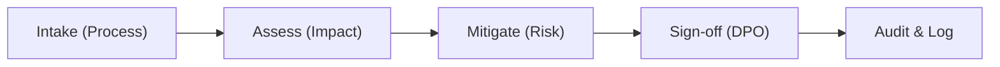

### 3. Distributed GDPR Compliance Topology
Strategically orchestrating DPIA assessments across global business units, regional data centers, and third-party processing partners, providing a unified institutional view of global privacy health and assessment readiness.

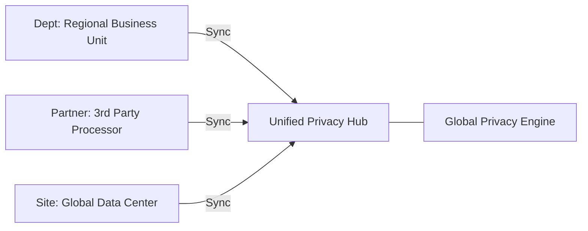

### 4. DSAR & DPIA Integration Flow
Executing complex logic for securing the bridge between citizen privacy requests (DSAR) and institutional impact assessments, ensuring every organizational identity is verified and every privacy access is according to institutional standards.

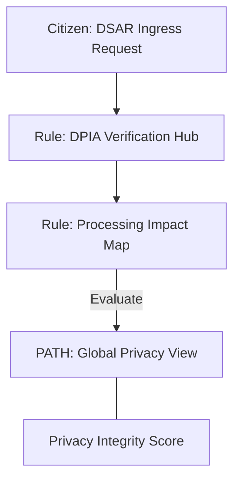

### 5. Multi-Jurisdiction Privacy Isolation & Governance Flow
Automatically managing privacy isolation and cross-border data transfer risk for global enterprises, ensuring institutional data residency and security boundaries by default across GDPR, CCPA, and LGPD.

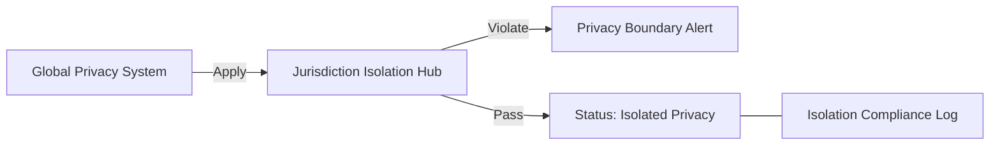

### 6. Encryption & Data Processing Protection Flow (Privacy Standard)
Managing the lifecycle of a processing request, automatically enforcing institutional encryption and pseudonymization standards for personal data as required by security policy, ensuring zero-latency security confidence.

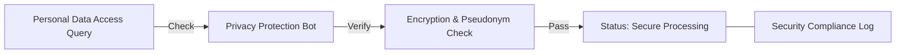

### 7. Institutional GDPR Maturity Scorecard
Grading organizational performance based on key indicators: DPIA Coverage Grade, Risk Mitigation Index, and Audit Readiness Index.

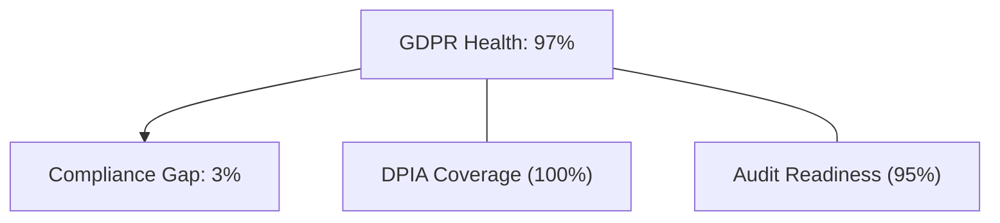

### 8. Identity & RBAC for Privacy Governance
Managing fine-grained access to privacy hubs, provisioning workers, and audit logs between Data Protection Officers (DPO), Privacy Engineers, and Business Process Owners.

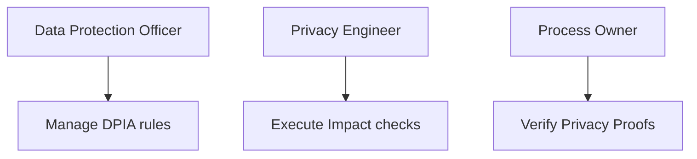

### 9. IaC Deployment: DPIA-as-Code Framework
Using modular Terraform to deploy and manage the versioned distribution of the privacy tracking hubs, assessment workers, and forensic metadata lakes.

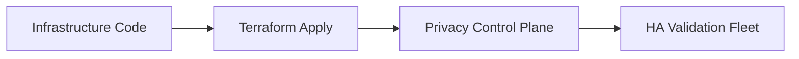

### 10. AIOps Privacy Drift & Risk Validation Flow
Using advanced analytics to identify sudden surges in high-risk processing activities, unauthorized data transfers, suspicious configuration drifts, or unusual privacy pattern changes that could result in institutional risk.

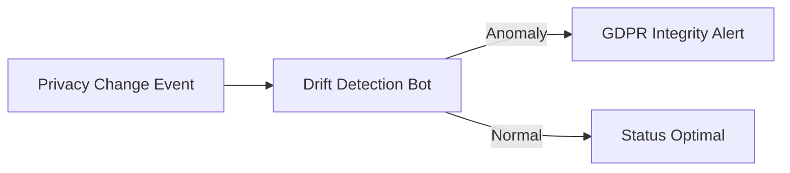

### 11. Metadata Lake for Forensic Privacy Audit
Storing long-term records of every DPIA conducted (metadata), every policy change recorded, and every supervisory authority event for institutional record-keeping, compliance auditing, and post-provisioning forensics.

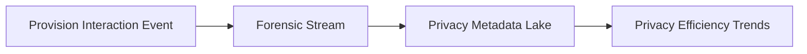

---

## 🏛️ Core Governance Pillars

1.  **Unified Foundation Coordination**: Maximizing resilience by centralizing all privacy measurement through a single institutional plane.
2.  **Automated Process Provisioning**: Eliminating "manual intake" scenarios through proactive orchestration and pattern verification.
3.  **Sequential Impact Intelligence**: Ensuring zero-interruption operations through dependency-aware impact-driven data engineering.
4.  **Zero-Trust Privacy Protection**: Automatically enforcing identity-based access and rule evaluation across all privacy tiers.
5.  **Autonomous Operations Logic**: Guaranteeing reliability through automated industry-specific privacy monitoring runbooks.
6.  **Full Privacy Auditability**: Immutable recording of every policy change and assessment provision for institutional forensics.

---

## 🛠️ Technical Stack & Implementation

### Privacy Engine & APIs
*   **Framework**: Python 3.11+ / FastAPI.
*   **Assessment Engine**: Custom Python-based logic for multi-cloud privacy provisioning and DORA-style impact metrics.
*   **Integrations**: Native connectors for GDPR Article 35 Guidance, NIST Privacy Framework, and ISO 27701.
*   **Persistence**: PostgreSQL (Privacy Ledger) and Redis (Live Privacy State).
*   **Auth Orchestrator**: Federated OIDC/SAML for least-privilege privacy management access.

### Governance Dashboard (UI)
*   **Framework**: React 18 / Vite.
*   **Theme**: Dark, Teal, Indigo (Modern high-fidelity privacy aesthetic).
*   **Visualization**: D3.js for privacy topologies and Recharts for mitigation velocity analytics.

### Infrastructure & DevOps
*   **Runtime**: AWS EKS or Azure Kubernetes Service (AKS) for management plane.
*   **Privacy Hub**: Managed event sourcing for immutable privacy security timeline reconstruction.
*   **IaC**: Modular Terraform for deploying the GDPR landing zone and validation fleet.

---

## 🏗️ IaC Mapping (Module Structure)

| Module | Purpose | Real Services |
| :--- | :--- | :--- |
| **`infrastructure/privacy_hub`** | Central management plane | EKS, PostgreSQL, Redis |
| **`infrastructure/assessors`** | Distributed assessment provisioners | K8s Workers, Cloud APIs |
| **`infrastructure/intake_pipes`** | Privacy Intake Ingestion Hubs | Webhooks, Lambda |
| **`infrastructure/auditing`** | Forensic privacy sinks | S3, Athena, Quicksight |

---

## 🚀 Deployment Guide

### Local Principal Environment
```bash
# Clone the landing zone platform
git clone https://github.com/devopstrio/gdpr-dpia-toolkit.git
cd gdpr-dpia-toolkit

# Configure environment
cp .env.example .env

# Launch the GDPR stack
make init

# Trigger a mock privacy intake and automated impact validation simulation
make simulate-privacy
```

Access the Management Portal at `http://localhost:3000`.

---

## 📜 License
Distributed under the MIT License. See `LICENSE` for more information.

---
<div align="center">
  <p>© 2026 Devopstrio. All rights reserved.</p>
</div>
